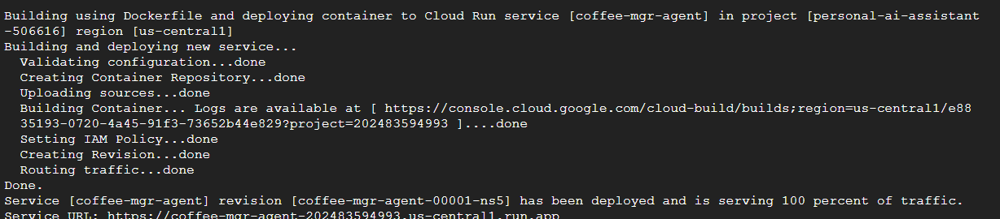
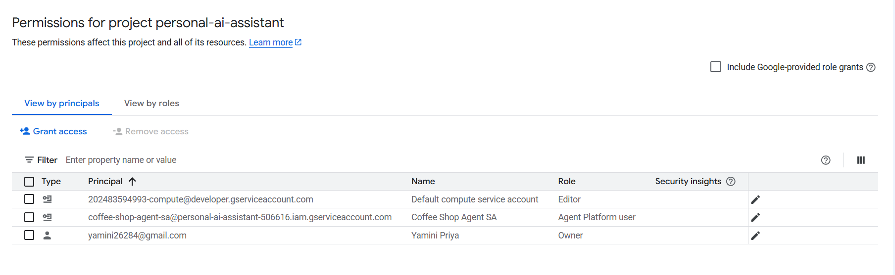
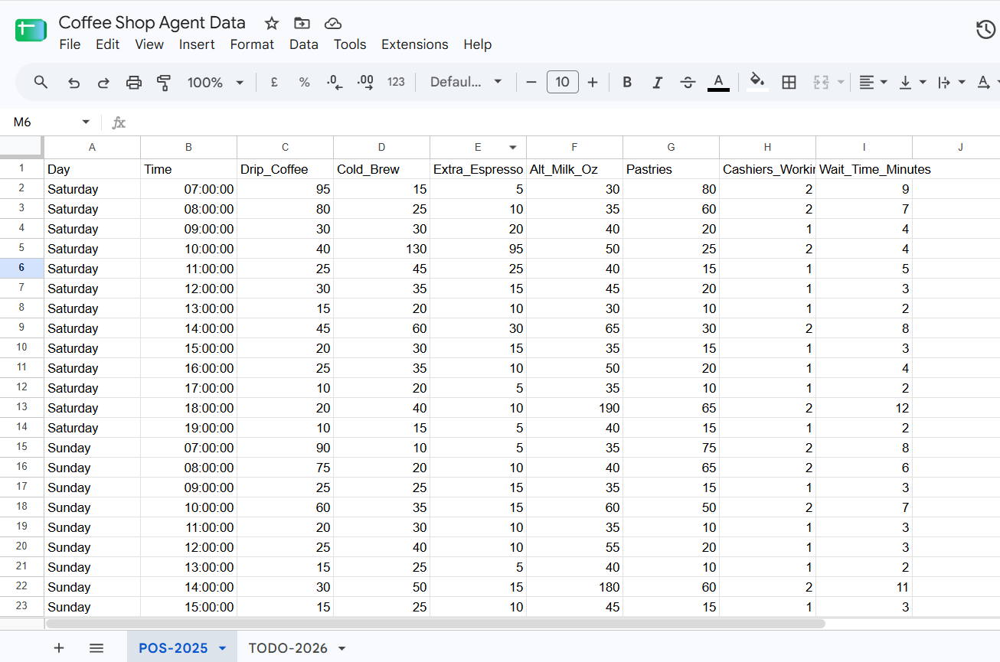
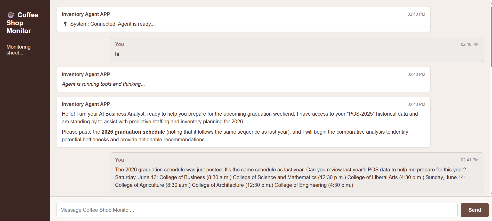
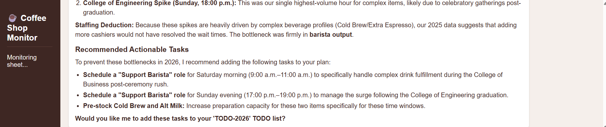
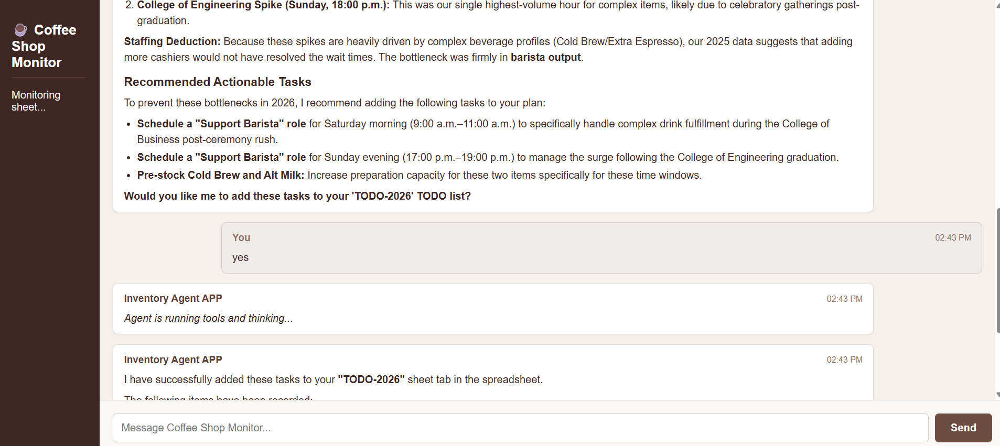
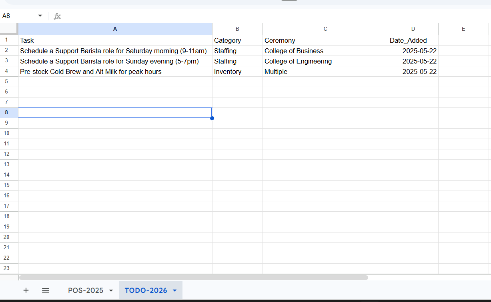

# ☕ Coffee Shop Manager Agent

A personal AI agent built on **Google Cloud Run**, the **Agent Development Kit (ADK)**, and **Cloud Run sandboxes** that helps a coffee shop manager analyze POS data, predict operational bottlenecks around big events, and get staffing/inventory recommendations — all through a simple chat UI.

Built as part of Google's [Run a personal agent on a Cloud Run service](https://codelabs.developers.google.com/codelabs/cloud-run/cloud-run-personal-agent-coffee-shop) codelab.

## 📖 The Scenario

You manage a coffee shop in a college town during graduation weekend. Last year's Point-of-Sale (POS) data shows demand spikes and long wait times tied to specific ceremony end-times. This year's graduation schedule follows the same sequence — so the agent cross-references historical sales data with this year's schedule to predict *when* and *where* bottlenecks will happen, and recommends concrete staffing/inventory fixes before they occur.

## 🧠 How It Works

1. **Data ingestion** — The agent reads last year's POS data (`POS-2025` tab) directly from a Google Sheet via the Sheets API.
2. **Sandboxed analysis** — Instead of relying purely on the LLM's reasoning, the agent writes and executes a Python script *inside a secure Cloud Run sandbox* to correlate beverage complexity, cashier headcount, and wait times against ceremony times.
3. **Diagnosis & recommendations** — Using a rules-based playbook baked into its instructions, the agent distinguishes "we need more cashiers" bottlenecks from "we need more barista output" bottlenecks, and proposes 2-3 concrete tasks.
4. **Human-in-the-loop approval** — The agent never writes to the spreadsheet without explicit sign-off. It presents findings in chat and asks: *"Would you like me to add these tasks to your 'TODO-2026' TODO list?"*
5. **Action** — On approval, it creates a new `TODO-2026` sheet tab (if needed) and writes out the approved tasks with category, related ceremony, and date.

## 🏗️ Architecture

```
┌─────────────────┐      WebSocket      ┌──────────────────────────┐
│  Chat UI (HTML)  │ ◄─────────────────► │   FastAPI on Cloud Run    │
└─────────────────┘                      │                            │
                                          │  ┌──────────────────────┐  │
                                          │  │   ADK LlmAgent        │  │
                                          │  │  (Gemini via Vertex)  │  │
                                          │  └──────────┬───────────┘  │
                                          │             │              │
                                          │   ┌─────────┴──────────┐   │
                                          │   │                     │   │
                                          │ Cloud Run Sandbox   Sheets API │
                                          │ (runs Python/shell)  (read/write)│
                                          └──────────────────────────┘
```

**Stack:**
- **Cloud Run** — hosts the FastAPI service (with `--sandbox-launcher` for secure code execution)
- **ADK (Agent Development Kit)** — orchestrates the LLM agent and its tools
- **Gemini (via Vertex AI)** — the reasoning engine behind the agent
- **Cloud Run Sandbox** — isolated environment where the agent writes/runs Python analysis scripts on the fly
- **Google Sheets API** — data source (POS history) and destination (TODO list) for the agent
- **FastAPI + WebSockets** — real-time chat interface between the manager and the agent
- **Dedicated Service Account** — least-privilege IAM: `aiplatform.user` role only, granted Editor access to a single spreadsheet

## 📁 Project Structure

```
coffee-mgr-agent/
├── main.py            # FastAPI app, ADK agent + tools, WebSocket chat UI
├── Dockerfile          # Container build for Cloud Run
├── requirements.txt    # Python dependencies
├── pos_data.csv        # Sample historical POS data (graduation weekend 2025)
└── README.md
```

## 🚀 Setup & Deployment

### 1. Prerequisites
- A Google Cloud project with billing enabled
- `gcloud` CLI configured (or use Cloud Shell)

### 2. Enable required APIs
```bash
gcloud services enable run.googleapis.com cloudbuild.googleapis.com \
    artifactregistry.googleapis.com sheets.googleapis.com aiplatform.googleapis.com
```

### 3. Create a dedicated service account
```bash
gcloud iam service-accounts create coffee-shop-agent-sa \
  --display-name="Coffee Shop Agent SA"

gcloud projects add-iam-policy-binding $GOOGLE_CLOUD_PROJECT \
  --member="serviceAccount:coffee-shop-agent-sa@$GOOGLE_CLOUD_PROJECT.iam.gserviceaccount.com" \
  --role="roles/aiplatform.user"
```

### 4. Set up the Google Sheet
- Create a sheet with a `POS-2025` tab, import `pos_data.csv`
- Share it with the service account email (Editor access)
- Copy the spreadsheet ID from its URL

### 5. Deploy to Cloud Run
```bash
gcloud beta run deploy coffee-mgr-agent \
    --source=. \
    --region=$REGION \
    --sandbox-launcher \
    --max-instances=1 \
    --session-affinity \
    --allow-unauthenticated \
    --no-cpu-throttling \
    --set-env-vars GOOGLE_GENAI_USE_VERTEXAI=1,GOOGLE_CLOUD_PROJECT=$GOOGLE_CLOUD_PROJECT,GOOGLE_CLOUD_LOCATION=global,SPREADSHEET_ID=$SPREADSHEET_ID \
    --service-account coffee-shop-agent-sa@$GOOGLE_CLOUD_PROJECT.iam.gserviceaccount.com
```

## 📸 Setup

**Cloud Run service deployed and running:**



**Dedicated service account with least-privilege IAM roles:**



**Historical POS data source (`POS-2025` tab):**



## 💬 Demo

**1. Ask the agent to analyze the upcoming schedule against last year's data:**



**2. The agent runs Python analysis inside a Cloud Run sandbox and reports findings:**



**3. Human-in-the-loop: the agent waits for explicit approval before writing anything:**



**4. Approved tasks are written to a new `TODO-2026` tab in the spreadsheet:**



## 🔒 Security Notes

- The service account is scoped to only what it needs (`aiplatform.user` + Editor on one specific spreadsheet), not project-wide access.
- Code execution happens inside an isolated Cloud Run sandbox, not directly on the host — untrusted/LLM-generated code never touches the underlying container.
- No spreadsheet write happens without an explicit human "yes."

## 📚 What I Learned

- How to deploy an ADK-based agent as a Cloud Run service using buildpacks (no manual Docker build needed)
- How Cloud Run sandboxes let an LLM safely write and execute its own analysis code on the fly
- Building a real-time WebSocket chat interface around an agent runner
- Designing a human-in-the-loop approval flow for an agent that can take real-world actions (writing to a spreadsheet)

---
Built by following Google's [Cloud Run personal agent codelab](https://codelabs.developers.google.com/codelabs/cloud-run/cloud-run-personal-agent-coffee-shop).
